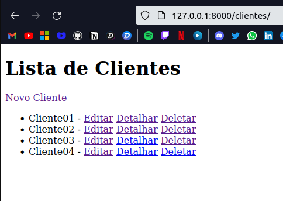
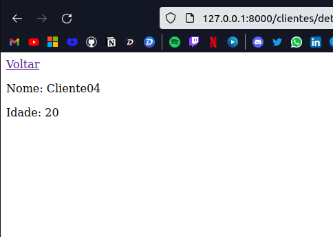
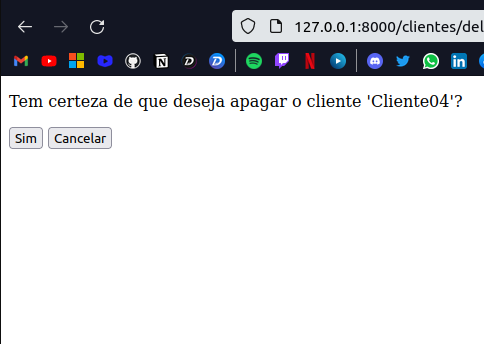

# 🐍 CRUD de Clientes 🐍

CRUD simples de clientes feito em Python com o framework Django.

 
 

## Imagens:

 
 

Na aplicação é possível visualizar todos os clientes através de uma lista:
 
 

  

 
 

Ao clicar no link "Novo Cliente", o usuário é redirecionado a uma nova página onde há um botão para <b>salvar</b>, e se houver alguma informação nos inputs, ao clicar no botão, elas serão guardadas no banco de dados; e há um botão para cancelar, que redireciona o usuário para o início:

 
 

  
  

 
 

O usuário pode ainda editar as informações, caso queira.

 
 

  
  

 
 

Como também pode deletá-las.

 
 

  
  

